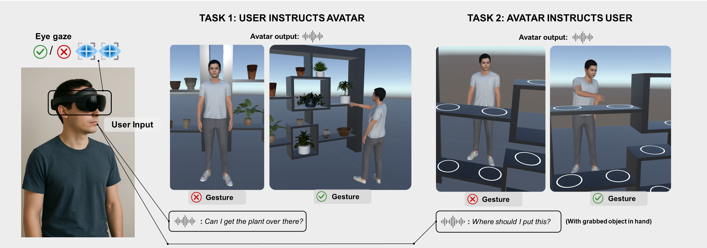
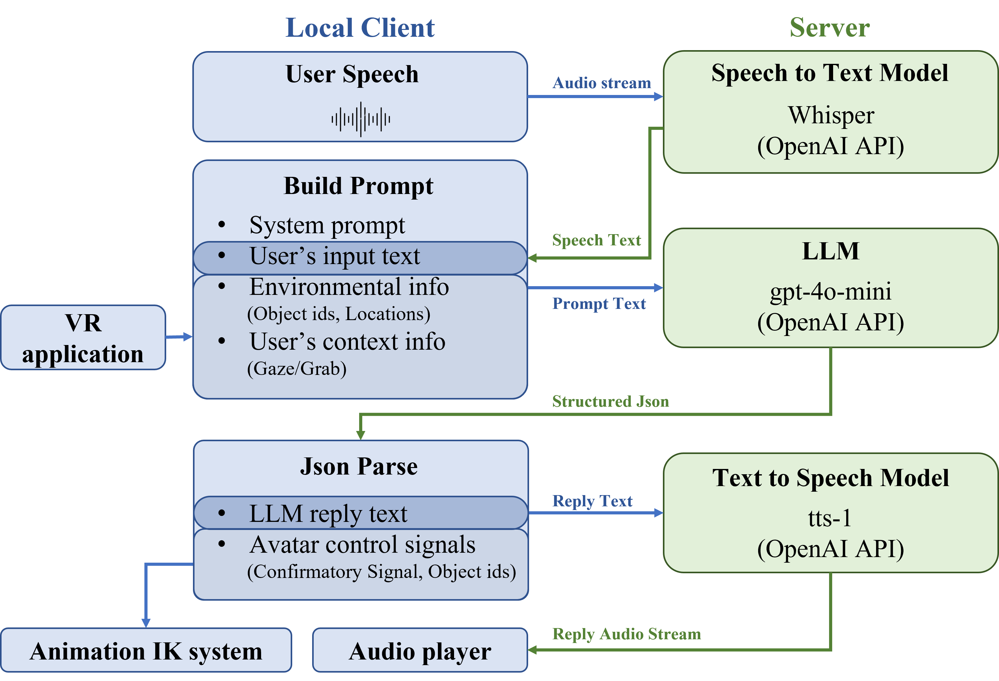

# BIRDS: Bi-directional Interaction for Referential Dialogue in Spatial Contexts for Virtual Reality



## Abstract
Embodied conversational agents in Virtual Reality (VR) are increasingly powered by large language models (LLMs) to enable natural language interaction, with most prior work remaining unidirectional by using gaze, gesture, and speech as inputs from the user to the agent. However, bi-directional multimodal communication where both users and agents use these modalities remains largely unexplored. To address this gap, we present BIRDS, a system for bi-directional referential dialogue with an LLM-driven agent in VR. In a controlled study ($N$ = 24), we found that agent gestures yielded the greatest benefits by reducing conversational turns and time while improving accuracy, trust, and user experience. Interestingly, gaze input alone had limited impact, but when combined with gestures, it produced the highest accuracy.  This suggests that the value of multimodality lies not only in efficiency gains but also in how non-verbal reciprocity shapes trust, social presence, and the perceived competence of embodied agents.

## System Overview
### System Design Overview：



### System Prompt
In the system prompts of each task, we defined the avatar's function and the meaning of input/output json schema. The prompts are saved in the dictionaries here:
[Task 1 prompts](./Assets/Resources/LLMPrompt/1_GatherItemGamePrompt/), [Task 2 Prompts](./Assets/Resources/LLMPrompt/2_BlockPuzzleGamePrompt/).

### Json Examples
We list the json example of Task 1 and Task 2 here: [Json Examples](./data_examples/)


## OpenAI Authentication

The OpenAI API in our project is based on [com.openai.unity](https://github.com/RageAgainstThePixel/com.openai.unity). To use the OpenAI API, authentication is required.


Prepare a file named `auth.json`.  
Where to save it depends on your platform:

```csharp
string authPath;
#if UNITY_ANDROID && !UNITY_EDITOR
    authPath = Path.Combine(Application.persistentDataPath, "auth.json");
#else
    var userPath = Environment.GetFolderPath(Environment.SpecialFolder.UserProfile);
    authPath = Path.Combine(userPath, ".openai", "auth.json");
#endif
```

#### Unity Editor
Save it to:
C:\Users\YourUsername\\.openai\auth.json

#### Standalone / Quest (Runtime)
Save it to:
Application.persistentDataPath/auth.json

⚠️ Keep your API key secure. Never share your credentials publicly.

Make sure your application switches between these paths appropriately depending on whether it is running in the Unity Editor or as a standalone build.

The `auth.json` format should be like below:
```json
{
    "apiKey": "sk-proj-aaaaaaaaaaaaaaaaaaaaaaa",
    "organizationId": "org-aaaaaaaaaaaaaaaaaaaaaa",
    "projectId": "proj_aaaaaaaaaaaaaaaaaaaa"
}
```
